# 📑 DOKUMENTASI TEKNIS - DEPLOYMENT CLOUD & ORKESTRASI KONTANER

**UAS ADMINISTRASI SERVER**

- **Nama Mahasiswa**: Khaerul Anam
- **Program Studi**: Informatika
- **Semester**: 6 (Enam)
- **Kampus**: UIN Siber Syekh Nurjati Cirebon
- **Repositori GitHub**: [anamofficial436-collab/UAS_Khaerul](https://github.com/anamofficial436-collab/UAS_Khaerul)

---

## 📋 PENDAHULUAN & ARSITEKTUR CI/CD

Dokumentasi ini disusun untuk memenuhi kriteria penilaian UAS mata kuliah Administrasi Server. Proyek ini mengintegrasikan **Web Statis** dan **Web Dinamis** ke dalam satu infrastruktur cloud di **AWS EC2** yang diorkestrasikan menggunakan **Docker Compose** dan dideploy secara otomatis menggunakan **GitHub Actions** melalui pendekatan modern _Continuous Integration & Continuous Deployment (CI/CD)_.

### 🌐 Alur Arsitektur Deployment & CI/CD

1. **Push Trigger**: Setiap kali perubahan kode dilakukan dan di-`push` ke branch `main`, pipeline GitHub Actions akan terpicu secara otomatis.
2. **Paths Filter (Smart Build)**: Pipeline mendeteksi folder mana yang mengalami perubahan menggunakan `paths-filter`. Jika hanya folder `web-dinamis` yang berubah, maka runner hanya akan memproses build untuk komponen tersebut demi menghemat efisiensi waktu eksekusi.
3. **Build & Push Images**: GitHub Runner masuk ke **Docker Hub** menggunakan token kredensial terenkripsi. Kode dikompilasi langsung ke dalam Docker Image terpisah (`web-statis` dan `web-dinamis`) dengan memanfaatkan sistem caching GitHub Actions (`type=gha`), lalu dipublikasikan ke Docker Hub registry.
4. **Deploy via SSH & SCP**: Konfigurasi `docker-compose.yml` serta `.env.example` ditransfer ke AWS EC2 menggunakan protokol SCP. Pipeline kemudian melakukan koneksi SSH remote ke VM EC2 untuk memperbarui environment, menarik (_pull_) image terbaru, membersihkan kontainer bentrok, dan menyalakan ulang layanan microservices dalam mode background (`detached mode`).

### 📊 Diagram Arsitektur Sistem

```mermaid
graph TD
    Dev[Khaerul Anam / Developer] -->|Git Push to main| GitHub[GitHub Repository]

    subgraph "GitHub Actions Runner (CI)"
        GitHub --> Work[Workflow deploy.yml]
        Work -->|Paths-Filter| BuildStatis[Build Nginx Web Statis]
        Work -->|Paths-Filter| BuildDinamis[Build Node.js/Next.js Web Dinamis]
    end

    BuildStatis -->|Push Image| DockerHub[(Docker Hub Registry)]
    BuildDinamis -->|Push Image| DockerHub

    Work -->|SCP Config Files| EC2[AWS EC2 Instance Host]
    Work -->|SSH Remote Script| EC2

    subgraph "Docker Compose Orchestration (AWS EC2 VM - CD)"
        EC2 -->|Docker Compose Pull| DockerHub
        EC2 --> Statis[app_web_statis Nginx:alpine]
        EC2 --> Dinamis[app_web_dinamis Next.js Production]
    end

    User([Dosen Penguji / Pengguna]) -->|HTTP Port 80| Statis
    User -->|HTTP Port 3000| Dinamis


    DOKUMENTASI VERIFIKASI PENGUJIAN
Berikut adalah galeri bukti pengujian teknis yang memverifikasi keberhasilan dari setiap tahapan deployment Administrasi Server:

1. Struktur Workspace & Proyek di IDE
Konfigurasi Workspace di Visual Studio Code (VS Code):
Bukti susunan folder proyek di lokal komputer, memperlihatkan folder .github/workflows, web-statis, web-dinamis, serta file docker-compose.yml.

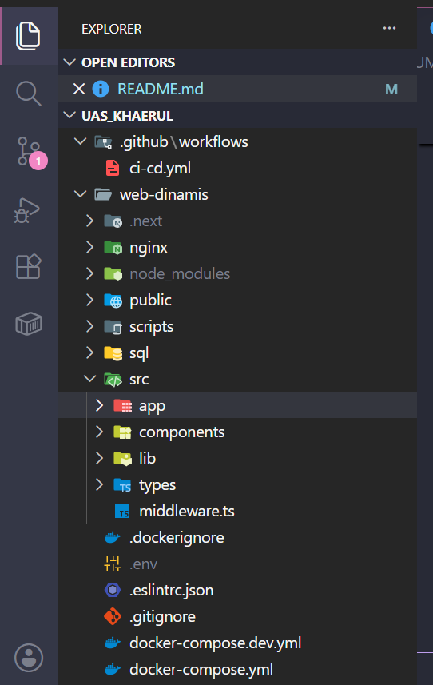

2. Tahap Inisialisasi AWS EC2 & Instalasi Docker
Inisialisasi Virtual Machine AWS EC2:
Bukti pembuatan instance Ubuntu Server baru di platform AWS Console yang digunakan sebagai server hosting.

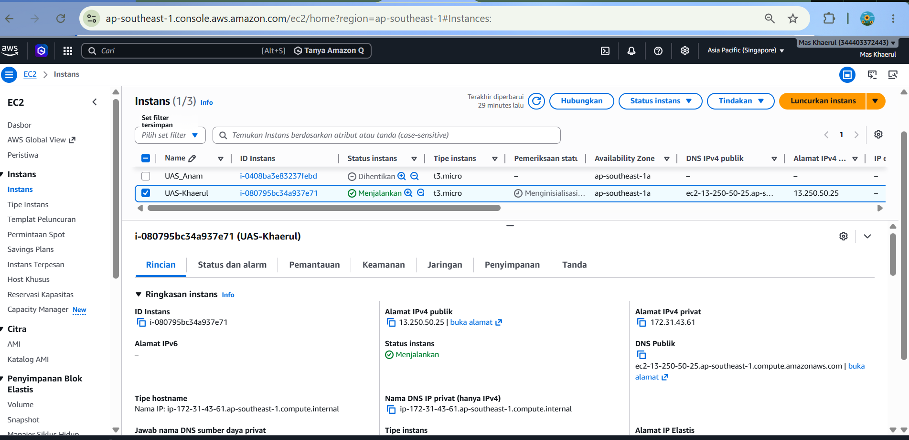

Konfigurasi AWS Security Group:
Pengaturan Inbound Rules di Security Group AWS EC2 yang membuka port akses masuk penting: port 22 (SSH), port 80 (HTTP Web Statis), dan port 3000 (HTTP Web Dinamis).

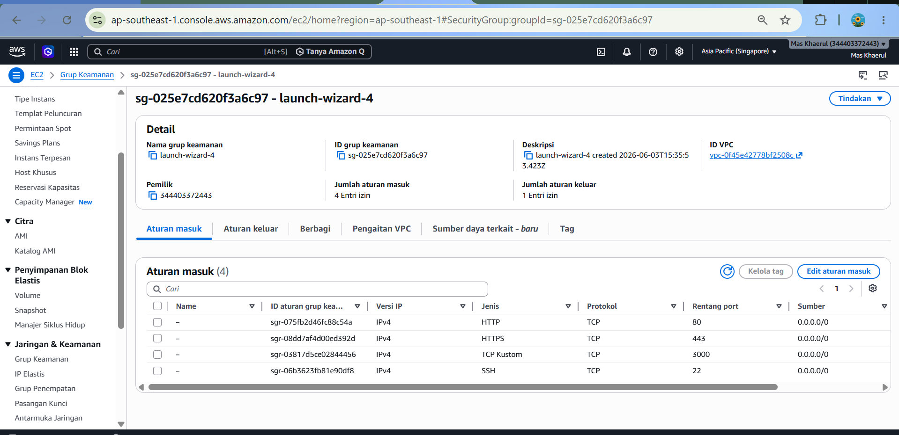

Instalasi Docker di Server Host VM:
Bukti bahwa Docker Engine dan Docker Compose telah terpasang dengan benar di dalam sistem operasi Ubuntu server EC2.

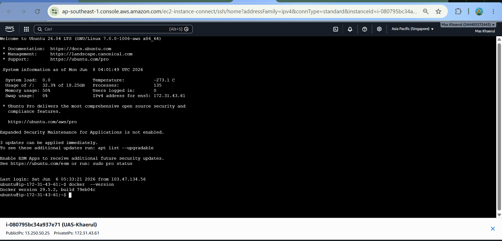

3. Konfigurasi CI/CD & Registry Docker Hub
Pembuatan Secrets Repository GitHub:
Daftar variabel rahasia yang telah dienkripsi di menu Settings -> Secrets and Variables -> Actions pada repositori GitHub (EC2_HOST, EC2_USER, EC2_SSH_KEY, DOCKER_USERNAME, DOCKER_PASSWORD).

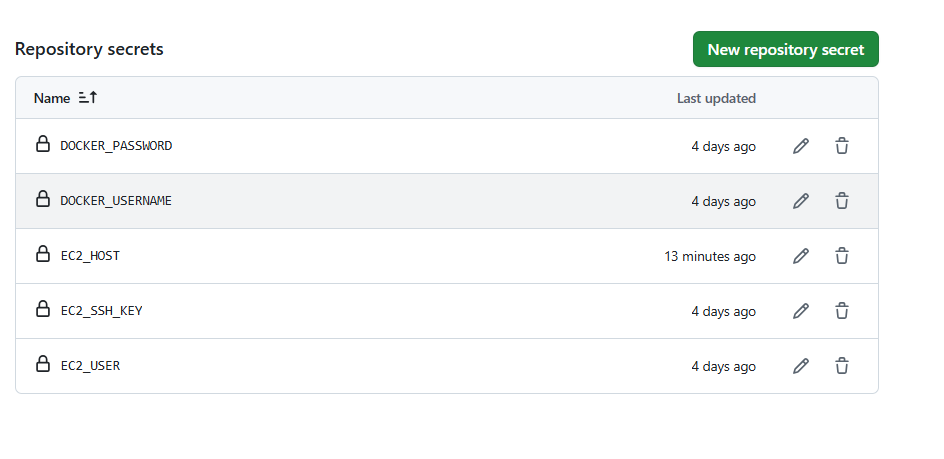

Registrasi Repositori Image di Docker Hub:
Tampilan halaman Docker Hub yang memperlihatkan image hasil build pipeline telah sukses tersimpan di cloud registry.

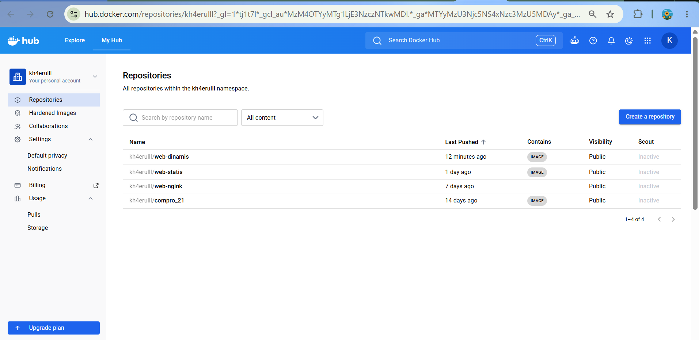

4. Pipeline CI/CD & Proses Deployment
Eksekusi Sukses GitHub Actions Workflow (Push to Deploy):
Bukti pipeline GitHub Actions berjalan mulus dari atas sampai bawah hingga mendapatkan seluruh lambang centang hijau.

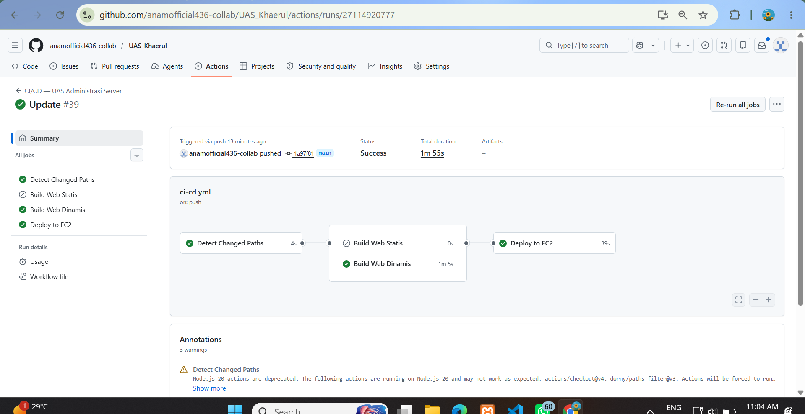

Proses Deploy di VM (SSH & Docker Compose Run):
Log pada GitHub Actions yang menampilkan keberhasilan koneksi SSH ke EC2 dan penarikan image baru.

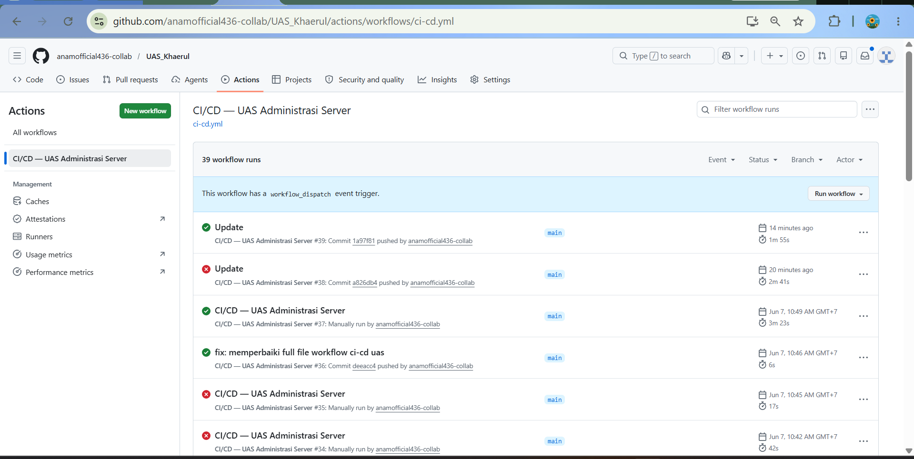

Verifikasi Kontainer yang Berjalan di VM (Docker PS):
Output dari eksekusi perintah sudo docker ps langsung di dalam terminal server EC2, membuktikan kontainer aplikasi aktif dan mendengarkan pada port masing-masing.

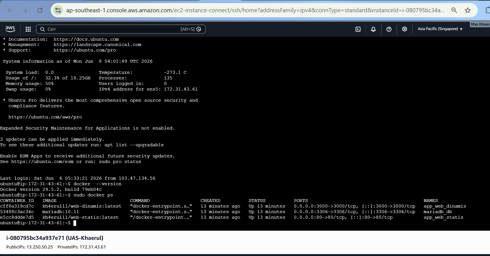

5. Verifikasi Akses Port & Fungsionalitas Web
Akses Web Statis (Port 80):
Halaman web statis yang sukses diakses secara publik melalui IP Address publik AWS EC2 pada port 80.

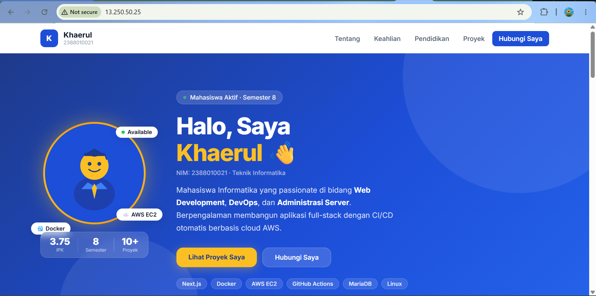

Akses Web Dinamis (Port 3000):
Aplikasi web dinamis yang sukses diakses secara publik menggunakan IP Address publik AWS EC2 dengan port khusus :3000.

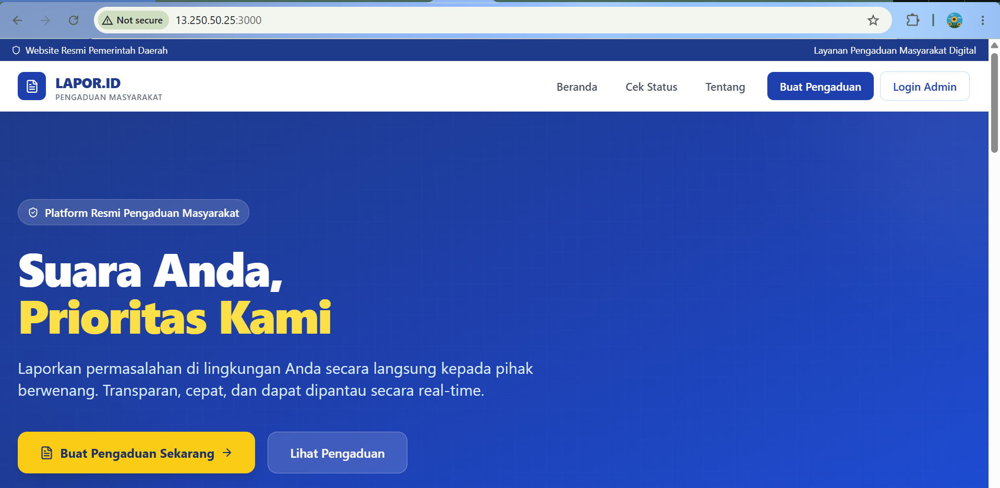
```
